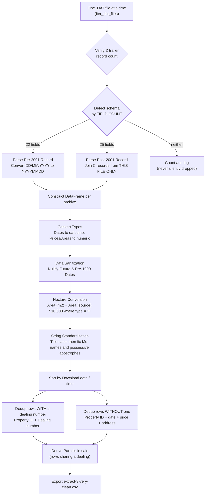

# NSW Property Sales Data Dictionary

## 1. Overview & Data Provenance

The **NSW Property Sales Dataset** is derived from official bulk Property Sales Information (PSI) published by the **NSW Valuer General**. The dataset captures real estate sales transactions across all Local Government Areas (LGAs) and property districts within New South Wales from 1990 to the present.

- **Primary Authority**: Valuer General NSW ([valuergeneral.nsw.gov.au](https://www.valuergeneral.nsw.gov.au/))
- **Source Files**: Bulk weekly updates and 35+ years of historical annual archive `.zip` files containing semicolon-delimited `.dat` records.
- **Licensing**: **Creative Commons Attribution**, per the `creative_commons.txt` licence file shipped inside every data archive — the instrument actually delivered with the data. It carries no NonCommercial, NoDerivatives or ShareAlike terms, and expressly permits Derivative Works. Attribution goes to Valuation NSW (formerly Valuer General NSW). The web copy contradicts itself and is not treated as authoritative; see the Licensing & Attribution section of [readme.md](readme.md). The repository's own code is MIT licensed.
- **Cleaned Output**: `extract-3-very-clean.csv` (and compressed as `nsw-property-sales-data-updatedYYYYMMDD.zip` / `archive.zip`).

---

## 2. Output Column Specification (`extract-3-very-clean.csv`)

The cleaned dataset consolidates **33 standardized columns**, in the order below. Text strings are title-cased (with the `Mc` and apostrophe corrections noted below), areas are unified into square metres, whole-number columns use the nullable `Int64` type, and dates are normalized into ISO format (`YYYY-MM-DD`).

> **Schema v2.** Three columns were renamed and six added relative to the previous 27-column output. Nothing was removed. The renames: `Area` -> `Area (m2)`, `Area type` -> `Area type (source)`, plus a new `Area (source)`.

| # | Column Name | Cleaned Type | Source Register | Pre-2001 Support | Description & Transformation Notes |
|---|---|---|---|---|---|
| 1 | **`District code`** | `String` | Register of Land Values | Yes | 3-digit Valuer General valuation district (roughly an LGA), e.g. `001`, `077`. See section 6. |
| 2 | **`Property ID`** | `Int64` / `String` | Register of Land Values | Partial | Unique numeric identifier assigned to every parcel/property in NSW. **Empty on ~31% of pre-2001 records** — use `Valuation number` for those. See Caveat 1. |
| 3 | **`Valuation number`** | `String` | Register of Land Values | Pre-2001 only | Legacy 13-digit valuation reference, e.g. `0610300000000`. For archived records with no `Property ID`, this is the only property identifier available. |
| 4 | **`Sale counter`** | `Int64` / `String` | Register of Land Values | No (`null`) | Sequence counter for the transaction **within one source file only** — the spec states "Unique for file". It is *not* a stable per-property sequence and must not be used as a key. See Caveat 2. |
| 5 | **`Download date / time`** | `Datetime` (`YYYY-MM-DD HH:MM:SS`) | Register of Land Values | No (`null`) | Timestamp when the source record was extracted by the Valuer General. Parsed from the source's `CCYYMMDD HH24:MI` into a real datetime, so it can be compared and subtracted without every consumer re-parsing it. Used to order deduplication so the newest restatement wins. **The honest way to check how fresh the dataset is** — `df['Download date / time'].max()`. |
| 6 | **`Property name`** | `String` | Register of Land Values | No (`null`) | Named estate, building, or rural property name. Title-cased. |
| 7 | **`Property unit number`** | `String` | Register of Land Values | Yes | Unit/apartment number (including unit suffixes, e.g., `1A`, `Shop 2`). |
| 8 | **`Property house number`** | `String` | Register of Land Values | Yes | Street house number (including ranges and suffixes, e.g., `27A`, `1-5`). |
| 9 | **`Property street name`** | `String` | Register of Land Values | Yes | Street name including street type and suffix (e.g., `Bathurst Road`, `Great Western Highway`). Title-cased. |
| 10 | **`Property locality`** | `String` | Register of Land Values | Yes | Suburb, town, or locality name (e.g., `Lawson`, `Katoomba`, `Surry Hills`). Title-cased. |
| 11 | **`Property post code`** | `Int64` | Register of Land Values | Yes | 4-digit Australian postal code (e.g., `2783`, `2000`). A small number of NSW properties carry VIC/QLD border postcodes (`3644`, `4380`) — these are legitimate. |
| 12 | **`Area (m2)`** | `Float64` | *Derived* | Yes | **Total land area in square metres (m²)**, converted where the source recorded hectares. This is the column to use for analysis. Keeps genuine decimals — 2,728,419 rows have a fractional part. **Do not convert it again** — see `Area (source)`. |
| 13 | **`Area (source)`** | `Float64` | Register of Land Values | Yes | The land area exactly as the source file recorded it, in whatever unit `Area type (source)` names. Kept so the conversion can be checked rather than taken on trust. |
| 14 | **`Area type (source)`** | `String` | Register of Land Values | Yes | The unit of **`Area (source)`**: `M` = square metres, `H` = hectares. 552,850 rows are `H`. The `(source)` suffix is deliberate — in the old schema this column sat beside an already-converted `Area`, which invited a second multiplication by 10,000. |
| 15 | **`Dimensions`** | `String` | Register of Land Values | Pre-2001 only | Frontage × depth as recorded, e.g. `20.72 X 40.23`. Not published in the post-2001 format. |
| 16 | **`Contract date`** | `Date` (`YYYY-MM-DD`) | Notice of Sale | Yes | Date contracts were exchanged. Converted from `YYYYMMDD` (or pre-2001 `DD/MM/YYYY`). Future dates and pre-1990 dates are nulled to `NaT`. ⚠️ Contains genuine data-entry errors — see Caveat 3. |
| 17 | **`Settlement date`** | `Date` (`YYYY-MM-DD`) | Notice of Sale | No (`null`) | Date transaction settled. Sourced from Notice of Sale in post-2001 data. Future dates and pre-1990 dates are nulled to `NaT`. On 933 rows this precedes `Contract date`, which is impossible — see `Date error flag`. |
| 18 | **`Purchase price`** | `Int64` | Notice of Sale | Yes | Sale transaction price in AUD, whole dollars. ⚠️ Not always the value of a whole property — check `Part interest flag` and `Parcels in sale` first. See Caveats 4 and 5. |
| 19 | **`Zoning`** | `String` | Register of Land Values | Yes | Planning/zoning classification code, passed through raw. ⚠️ Codes were **reused with different meanings** in the 2022 reform — see the warning in section 4. There is deliberately **no** decoded zoning column; see Caveat 6. |
| 20 | **`Nature of property`** | `String` | Notice of Sale | No (`null`) | Source classification code: `R`, `V` or `3`. Kept raw beside the decoded version. |
| 21 | **`Nature of property (description)`** | `String` | *Derived* | No (`null`) | Plain-English decode of the column above: `Residence` (4,047,630 rows), `Vacant land` (579,486), `Other` (405,357). Null for pre-2001 rows, which do not carry the field. |
| 22 | **`Primary purpose`** | `String` | Notice of Sale | No (`null`) | Primary property usage, as recorded. Title-cased, otherwise untouched. ⚠️ **Effectively a free-text field, not a code list: 10,946 distinct values**, of which 7,257 occur exactly once. Truncated by the source at 14 characters, producing variants like `Commercial Off`, `Retir'T Villag`, `Primary Produc`. `Residence` alone is 80.9% of populated rows. `Null` also appears as a literal string on 5,280 rows. |
| 23 | **`Primary purpose (normalised)`** | `String` | *Derived* | No (`null`) | The column above collapsed into seven categories: `Residence`, `Vacant land`, `Commercial`, `Rural`, `Industrial`, `Car space`, or `Unclassified`. Covers **99.55%** of populated rows; the remainder is reported as `Unclassified` rather than guessed at. Null where the source recorded nothing. See section 5. |
| 24 | **`Strata lot number`** | `Int64` | Notice of Sale | No (`null`) | Individual lot number for strata title units/townhouses. Often differs from `Property unit number` — they are not interchangeable. |
| 25 | **`Component code`** | `String` | Register of Land Values | Yes | Valuer General internal code (`AAA`, `RMP`, `AUS`…). Passed through undecoded; no published meaning. Populated on ~55% of rows. |
| 26 | **`Sale code`** | `String` | Notice of Sale | No (`null`) | Flags a non-standard sale (`AC`, `XA`, `AV`, `RR`…). No published code list. Populated on ~2.7% of rows, which form a distinct population — `XA` sales have a markedly higher median price. |
| 27 | **`% Interest of sale`** | `String` | Notice of Sale | No (`null`) | Percentage of ownership transferred. **Null means 100%** (the source's `0` and blank are both normalized to null). A value here means `Purchase price` is for a *part share only*. See Caveat 4 and `Part interest flag`. |
| 28 | **`Dealing number`** | `String` | Notice of Sale | No (`null`) | Unique NSW Land Registry Services (LRS) dealing / document registration number. The reliable identifier for a post-2001 sale. |
| 29 | **`Parcels in sale`** | `Int64` | *Derived* | No (`null`) | How many rows share this `Dealing number` — i.e. how many parcels the one sale covered. `1` for a normal sale. Null pre-2001, where it is unknowable. See Caveat 5. |
| 30 | **`Property legal description`** | `String` | Register of Land Values | Yes | Complete Lot/Section/Plan description (e.g., `Lot 1 DP 123456`, `SEC B LOT 23 DP4748`). In post-2001 data, concatenated across multiple `C` records **from the same source file** without spaces, per the spec. Legitimately runs to thousands of characters for large subdivisions. |
| 31 | **`Part interest flag`** | `Boolean` | *Derived* | Yes (`False`) | `True` where `% Interest of sale` is populated, i.e. the price bought a part share. 35,691 rows. See section 2.2. |
| 32 | **`Non-market price flag`** | `Boolean` | *Derived* | Yes | `True` where `Purchase price` is missing, `0`, or under $1,000. 62,976 rows. See section 2.2. |
| 33 | **`Date error flag`** | `Boolean` | *Derived* | Yes (`False`) | `True` where `Settlement date` precedes `Contract date`, which is impossible. 933 rows. See section 2.2. |

---

### 2.2 Quality flags

Three boolean columns marking rows that are **not ordinary market sales**, so that every consumer stops reinventing the same heuristics with slightly different thresholds.

**They flag rows; they never remove them.** The pipeline describes the data, it does not decide on your behalf what counts as a real sale. Filtering is yours to do:

```python
market_sales = df[~df['Part interest flag'] & ~df['Non-market price flag']]
```

| Flag | `True` when | Rows | Why it matters |
| :--- | :--- | ---: | :--- |
| `Part interest flag` | `% Interest of sale` is populated | 35,691 | The price bought a **part share**, not the whole property. Median $206,250 against $365,000 for whole-property sales — left in, they look like cheap houses and drag down every median. |
| `Non-market price flag` | price is null, `0`, or under $1,000 | 62,976 | 52,280 rows are exactly **$0** — family transfers, related-party dealings, government acquisitions. Not sales at any price. |
| `Date error flag` | `Settlement date` < `Contract date` | 933 | Impossible, so at least one of the two dates is wrong. |

**Deliberately not flagged: long settlements.** The median settlement is 42 days, but 281,643 rows (4%) exceed a year and most of those are legitimate off-the-plan apartment sales. A flag that marks ordinary sales as suspicious is one people learn to ignore. Compute it from the two date columns if you need it.

**Deliberately not flagged: multi-parcel sales.** `Parcels in sale` already carries this, and `> 1` states it more clearly than a boolean would.

---

### 2.1 Caveats that affect analysis

These are properties of the source data, not bugs in the pipeline. Each has been measured against the full 1990–2026 corpus.

**1. `Property ID` is empty on ~31% of pre-2001 records.**
Roughly 732,800 rows have no `Property ID`; 724,600 of them do have a `Valuation number`. Only ~8,200 rows have no identifier at all. Never assume `Property ID` is populated when working across the archived era.

**2. `Sale counter` is unique per *file*, not per property.**
The spec says "Unique for file". The same `(District, Property ID, Sale counter)` triple legitimately refers to different sales in different weekly batches. Do not use it as a join or dedup key.

**3. Contract dates contain real errors.**
The Valuer General restates sales with corrected dates; one observed pair recorded the same dealing as `2002-12-23` and `2021-12-23`. Because of this, **never infer which schema era a record came from by its date** — use the presence of `Dealing number` instead. 46,536 records would be misclassified by a date-based split.

**4. `Purchase price` is not always a whole-property price — part shares.**
35,691 rows record the sale of a *part interest* (50%, 33%, 25%, and 1,175 sales of just 1%). Their median price is **$206,250 against $365,000 for whole-property sales**, so leaving them in drags every median down and fills the "suspiciously cheap" bucket. Filter with `~df['Part interest flag']` for whole-property sales only.

**5. `Purchase price` is repeated across multi-parcel sales.**
50,357 dealings cover more than one parcel; each parcel is its own row carrying the **full** sale price. That repeats the price on 72,631 rows. Summing or taking a median across them double-counts. Filter with `df['Parcels in sale'] == 1`, or group by `Dealing number` and take one row per sale.

**6. `Zoning` is missing on ~40% of rows**, and is not comparable across eras — see section 4.
There is deliberately **no decoded zoning column** in the output. A lookup keyed on the code alone would be wrong on either side of the 2022 reform: `E1` meant *National Parks and Nature Reserves* before it and *Local Centre* (a retail zone) after, so a 36-year dataset decoded that way would label shopfronts as national parks. A correct decode has to be keyed on `(code, contract date)` — and by Caveat 3 the dates are not reliable enough to lean on. The raw code is published and the meanings are in section 4; joining them is a decision for the analyst, made with the era in view.

---

## 3. Pre-2001 vs. Post-2001 Schema Comparison

The NSW Valuer General transitioned systems in 2001. Our pipeline dynamically inspects the 3rd field of each `B` record:
- If field 3 is non-numeric (e.g., `ARCHIVE`, `VALNET1`), it is parsed as **Archived Pre-2001 Layout**.
- If field 3 is numeric, it is parsed as **Current Post-2001 Layout**.

```
┌────────────────────────────────────────────────────────────────────────┐
│ Pre-2001 Data Layout (1990 - 2001)                                     │
│ • Semicolon-delimited, single-line B record containing legal desc      │
│ • Source tag in field 3 (e.g., B;077;ARCHIVE;...)                     │
│ • Dates in DD/MM/YYYY format                                           │
│ • No Settlement Date, Nature of Property, or Dealing Number            │
├────────────────────────────────────────────────────────────────────────┤
│ Post-2001 Data Layout (2001 - Present)                                 │
│ • Semicolon-delimited B record (Property & Sales info)                 │
│ • Supplementary C records (Legal descriptions joined on District+ID)   │
│ • D records (Owner details suppressed for privacy)                     │
│ • Dates in CCYYMMDD format                                             │
└────────────────────────────────────────────────────────────────────────┘
```

### Raw Field Mapping Comparison

| Output Field | Pre-2001 Raw Field Index | Post-2001 Raw Field Index | Schema Notes |
|---|---|---|---|
| `Record Type` | 0 (`'B'`) | 0 (`'B'`) | Identifies sales data record |
| `District Code` | 1 | 1 | 3-digit district identifier |
| *Source Identifier* | 2 (`'ARCHIVE'` / `'VALNET1'`) | *N/A* | Used by parser to detect pre-2001 files |
| `Property ID` | 4 | 2 | Unique property ID in Register of Land Values |
| `Sale Counter` | *N/A* | 3 | File-specific sequence counter |
| `Download date / time` | *N/A* | 4 | Extract generation timestamp |
| `Property Name` | *N/A* | 5 | Building / property name |
| `Property unit number` | 5 | 6 | Unit number + unit suffix |
| `Property house number` | 6 | 7 | House number prefix + number + suffix |
| `Property street name` | 7 | 8 | Street name, type, and suffix |
| `Property locality` | 8 | 9 | Suburb or town |
| `Property post code` | 9 | 10 | 4-digit postcode |
| `Contract date` | 10 (`DD/MM/YYYY`) | 13 (`CCYYMMDD`) | Converted to unified ISO `YYYY-MM-DD` |
| `Purchase price` | 11 | 15 | Transaction price in AUD |
| `Property legal description` | 12 (`Land_Description`) | Joined from `C` records | Matched by `(District, Property ID, Sale counter)` **within a single source file only** - the key is not unique across files |
| `Area (source)` | 13 | 11 | Land measurement, as recorded |
| `Area type (source)` | 14 (`M` or `H`) | 12 (`M` or `H`) | Unit of `Area (source)` |
| `Dimensions` | 15 | *Omitted* | Dimension text (e.g., `20.72 X 40.23`) |
| `Settlement date` | *N/A* | 14 (`CCYYMMDD`) | Settlement date |
| `Zoning` | 17 | 16 | Zoning code |
| `Nature of property` | *N/A* | 17 (`V`, `R`, `3`) | Vacant / Residence / Other |
| `Primary purpose` | *N/A* | 18 | Description when Nature = 3 |
| `Strata lot number` | *N/A* | 19 | Strata lot identifier |
| `Dealing number` | *N/A* | 23 | LRS dealing number |

---

## 4. NSW Zoning Codes Reference

> ### ⚠️ Zoning codes were reused with different meanings in 2022
>
> The NSW Employment Zones Reform (commencing 2022) **recycled existing letter codes for entirely different purposes**. The most dangerous case:
>
> | Code | Before 2022 | From 2022 |
> | :--- | :--- | :--- |
> | `E1` | National Parks and Nature Reserves | **Local Centre** (a retail/commercial zone) |
> | `E2` | Environmental Conservation | Commercial Centre |
> | `E3` | Environmental Management | Productivity Support |
> | `E4` | Environmental Living | General Industrial |
> | `C1`–`C4` | *(not in use)* | Conservation zones, taking over the old `E1`–`E4` roles |
>
> **A filter like `Zoning == 'E1'` across the full 35 years silently mixes national parks with shopfronts.** The dataset holds both vintages in one column with nothing to distinguish them but the contract date — and contract dates are unreliable (Caveat 3).
>
> The table in 4.1 below documents the **pre-2022** meanings. Treat any `E`-code result as era-dependent and cross-check against `Contract date` and `Primary purpose`.

In 2011, the NSW Department of Planning introduced the Standard Instrument Local Environmental Plan (LEP). Prior to 2011, single-character codes were used.

### 4.1 Standard Instrument LEP Zones (Post-2011)

| Category | Zone Code | Zone Name | Former Single-Letter Equivalent |
|---|---|---|---|
| **Residential** | `R1` | General Residential | `A` |
| | `R2` | Low Density Residential | `A` |
| | `R3` | Medium Density Residential | `A` |
| | `R4` | High Density Residential | `A` |
| | `R5` | Large Lot Residential | `A` |
| **Business / Commercial** | `B1` | Neighbourhood Centre | `B` |
| | `B2` | Local Centre | `B` |
| | `B3` | Commercial Core | `B` |
| | `B4` | Mixed Use | `B` |
| | `B5` | Business Development | `B` |
| | `B6` | Enterprise Corridor | `B` |
| | `B7` | Business Park | `B` |
| **Industrial** | `IN1` | General Industrial | `I` |
| | `IN2` | Light Industrial | `I` |
| | `IN3` | Heavy Industrial | `I` |
| | `IN4` | Working Waterfront | `I` |
| **Rural** | `RU1` | Primary Production | `R` |
| | `RU2` | Rural Landscape | `R` |
| | `RU3` | Forestry | `R` |
| | `RU4` | Rural Small Holdings | `R` |
| | `RU5` | Village | `A` |
| | `RU6` | Transition | `R` |
| **Environment Protection** | `E1` | National Parks and Nature Reserves | `R` |
| | `E2` | Environmental Conservation | `R` |
| | `E3` | Environmental Management | `R` |
| | `E4` | Environmental Living | `R` |
| **Special Purpose** | `SP1` | Special Activities | `S` |
| | `SP2` | Infrastructure | `S` |
| | `SP3` | Tourist | `S` |
| **Recreation** | `RE1` | Public Recreation | `O` |
| | `RE2` | Private Recreation | `O` |
| **Waterways** | `W1` | Natural Waterways | `R` |
| | `W2` | Recreational Waterways | `O` |
| | `W3` | Working Waterways | `I` |

### 4.2 Legacy Zone Codes (Pre-2011)

| Zone Code | Official Name / Description |
|---|---|
| `A` | Residential |
| `B` | Business |
| `C` | Sydney Commercial / Business |
| `D` | 10(a) Sustainable Mixed Use Development |
| `E` | Employment |
| `I` | Industrial |
| `M` | 9(a) Mixed Residential / Business |
| `N` | National Parks |
| `O` | Open Space |
| `P` | Protection |
| `R` | Non-Urban |
| `S` | Special Uses |
| `T` | North Sydney Commercial / Business |
| `U` | Community Uses |
| `V` | Comprehensive Centre |
| `W` | Reserve Open Space |
| `X` | Reserved Roads |
| `Y` | Reserved Special Uses |
| `Z` | Undetermined or Village |

---

## 5. Categorical Value Codes Reference

### Nature of Property (`Nature of property`)

Decoded into `Nature of property (description)` in the output, so this table is for reference rather than for joining.

| Code | Rows | `Nature of property (description)` | Meaning |
| :--- | ---: | :--- | :--- |
| `R` | 4,047,630 | `Residence` | Established residential dwelling, house, townhouse, unit. |
| `V` | 579,486 | `Vacant land` | Undeveloped residential, commercial, or rural allotment. |
| `3` | 405,357 | `Other` | Commercial, industrial, rural, or non-residential; described further in `Primary purpose`. |
| *(blank)* | 1,988,863 | *(null)* | Pre-2001 records, which do not carry the field. |

Worth knowing: where the code is `R` or `V`, `Primary purpose` simply restates it. **All 10,946 distinct `Primary purpose` values sit inside the `3` rows.**

### Primary Purpose Categories (`Primary purpose (normalised)`)

`Primary purpose` is free text (see Caveat notes on the column). The normalised column collapses it with an ordered keyword rule set — the first category whose keyword appears in the value wins — covering **99.55%** of populated rows.

| Category | Rows | Typical raw values collapsed into it |
| :--- | ---: | :--- |
| `Residence` | 4,067,176 | `Residence`, `Home Unit`, `House`, `Townhouse`, `Villa`, `Flats` |
| `Vacant land` | 575,423 | `Vacant Land`, `Vacamt Land` |
| `Commercial` | 141,699 | `Commercial`, `Shop`, `Office`, `Hotel`, `Commercial Off`, `Service Statio` |
| `Rural` | 86,830 | `Farm`, `Farmland`, `Farm/Rural`, `Rural Land`, `Primary Produc` |
| `Industrial` | 41,731 | `Factory`, `Warehouse`, `Industrial`, `Storage Unit` |
| `Car space` | 7,201 | `Carspace`, `Car Space`, `Garage` |
| `Unclassified` | 22,034 | Text no rule matched, e.g. `Keg Roll`, `Rotunda`, `Mogo Zoo` |
| *(null)* | 2,079,242 | The source recorded nothing, or the literal string `Null` |

Two deliberate choices worth knowing:

- **`Unclassified` is not the same as null.** Null means the source told us nothing; `Unclassified` means it told us something no rule matched. Both are honest, and they are different facts.
- **Rule order is load-bearing.** Specific categories are tested before general ones, because matching the keyword `unit` for `Residence` first would file `Factory Unit` and `Storage Unit` as housing — 4,688 rows. If you add a keyword, put it under the most specific category that fits.

### Area Unit (`Area type (source)`)
- **`M`**: Square Metres ($m^2$).
- **`H`**: Hectares (1 Hectare = 10,000 m²). *Note: this code describes `Area (source)`. The `Area (m2)` column is already converted — do not multiply it again.*

### Owner Type (Source Internal)
- **`P`**: Purchaser.
- **`V`**: Vendor.

---

## 6. NSW Valuer General District Code Reference

District codes represent geographic valuation districts / Local Government Areas across NSW.

| Code | Council / LGA Name | Code | Council / LGA Name | Code | Council / LGA Name |
|---|---|---|---|---|---|
| `001` | Cessnock | `118` | Blayney | `240` | Gilgandra |
| `002` | Dungog | `123` | Oberon | `243` | Hay |
| `004` | Lake Macquarie | `124` | Orange | `244` | Lachlan |
| `005` | Maitland | `137` | Burwood | `247` | Narrabri |
| `007` | Muswellbrook | `139` | Canada Bay | `250` | Tenterfield |
| `008` | Newcastle | `143` | Strathfield | `251` | Narromine |
| `010` | Port Stephens | `144` | Sutherland | `252` | Walcha |
| `012` | Singleton | `148` | Ballina | `253` | Walgett |
| `018` | Bega Valley | `149` | Bellingen | `254` | Warren |
| `042` | Cowra | `150` | Byron | `255` | Wentworth |
| `043` | Weddin | `151` | Richmond Valley | `257` | Armidale Regional |
| `050` | Albury | `152` | Coffs Harbour | `258` | Canterbury-Bankstown |
| `051` | Berrigan | `157` | Kempsey | `259` | Central Coast |
| `052` | Carrathool | `158` | Kyogle | `260` | City of Parramatta |
| `054` | Coolamon | `159` | Lismore | `261` | Cumberland |
| `061` | Junee | `164` | Nambucca | `262` | Edward River |
| `065` | Leeton | `171` | Tweed | `263` | Federation |
| `066` | Lockhart | `187` | Gunnedah | `264` | Georges River |
| `070` | Narrandera | `188` | Inverell | `265` | Cootamundra-Gundagai Regional |
| `074` | Griffith | `192` | Moree Plains | `266` | Hilltops |
| `081` | The Hills Shire | `199` | Uralla | `267` | Inner West |
| `082` | Hornsby | `207` | Randwick | `268` | Mid-Coast |
| `083` | Hunters Hill | `209` | Waverley | `269` | Murray River |
| `084` | Ku-ring-gai | `210` | Woollahra | `270` | Murrumbidgee |
| `085` | Lane Cove | `214` | Blacktown | `271` | Northern Beaches |
| `087` | Mosman | `216` | Blue Mountains | `272` | Queanbeyan-Palerang Regional |
| `088` | North Sydney | `217` | Camden | `273` | Snowy Monaro Regional |
| `090` | Ryde | `218` | Campbelltown | `274` | Snowy Valleys |
| `092` | Willoughby | `219` | Hawkesbury | `275` | Dubbo Regional |
| `097` | Eurobodalla | `220` | Fairfield | `276` | Bayside |
| `098` | Kiama | `222` | Lithgow | `300` | Gwydir |
| `100` | Shellharbour | `223` | Liverpool | `301` | Liverpool Plains |
| `101` | Shoalhaven | `224` | Penrith | `302` | Glen Innes Severn |
| `102` | Wingecarribee | `226` | Wollondilly | `303` | Clarence Valley |
| `103` | Wollongong | `230` | Balranald | `511` | Upper Hunter |
| `109` | Cabonne | `231` | Bland | `526` | Upper Lachlan |
| `116` | Parkes | `232` | Bogan | `528` | Yass Valley |
| `117` | Forbes | `233` | Brewarrina | `529` | Goulburn Mulwaree |
| `234` | Broken Hill | `235` | Central Darling | `537` | Warrumbungle |
| `236` | Cobar | `238` | Coonamble | `538` | Temora |
| `239` | Bourke | `560` | Greater Hume | `575` | Wagga Wagga |
| `608` | Bathurst Regional | `620` | Mid Western Regional | `656` | Port Macquarie-Hastings |
| `666` | Tamworth Regional | `708` | City of Sydney | `902` | Unincorporated Area |
| `903` | Unincorporated Sydney Harbour | | | | |

---

## 7. Data Cleaning & Transformation Pipeline Summary



> **Why one file at a time, and why field count?** Both are correctness fixes, not style choices. The `C`→`B` legal-description key `(District, Property ID, Sale counter)` is only unique *within* a file, so reading every archive into one list glued unrelated descriptions together. And the old schema test — "is field 3 non-numeric?" — also matched an *empty* field, so a malformed current-format line was handed to the archived parser and produced a plausible-looking record from entirely wrong fields.

1. **In-Memory Nested Extraction**: `.zip` archives (and any nested inner `.zip` archives) are unzipped and read via in-memory bytes buffers (`io.BytesIO`), preventing tens of thousands of temporary files from being written to disk.
2. **Multi-Record Legal Description Joining**: `C` records contain chunks of the legal property description (up to 70 chars per line). These are concatenated sequentially without spaces according to Valuer General technical specifications.
3. **Date Conversion & Filtering**:
   - Dates in archived files (`DD/MM/YYYY`) are normalized to `CCYYMMDD` and then parsed as standard pandas `datetime64[ns]`.
   - Contract or settlement dates occurring after today's execution date or prior to `1990-01-01` are nulled (`NaT`) to safeguard against recording typos without discarding valid price/location data.
4. **Metric Area Normalization**:
   - Rows with `Area type (source) == 'H'` have `Area (m2)` set to `Area (source) * 10,000`, so every row shares a consistent unit of square metres. The untouched source figure stays in `Area (source)`.
5. **Casing Standardization**:
   - Government all-caps strings (`BLUE MOUNTAINS`, `LAWSON`, `GREAT WESTERN HWY`) are title-cased (`Blue Mountains`, `Lawson`, `Great Western Hwy`).
6. **Cross-Batch Deduplication**:
   - Rows are first sorted by `Download date / time` so that the most recently published version of a restated sale wins, and so the output does not depend on the order the operating system happened to list the archive files in.
   - Deduplication then splits on **whether the record carries a `Dealing number`** - never on its date, because contract dates are unreliable (Caveat 3):
     - **With a dealing number** (post-2001): keyed on `['Property ID', 'Dealing number']`. One dealing is one sale of one property, so this also catches sales the Valuer General later restated with a corrected date.
     - **Without a dealing number** (pre-2001): keyed on `['Property ID', 'Contract date', 'Purchase price', 'Property street name', 'Property house number', 'Property legal description', 'Property locality', 'Area (source)']`. The address fields are essential - about a third of archived records have no `Property ID`, and without them any two blank-ID properties sold on the same day for the same price collapse into one row.
